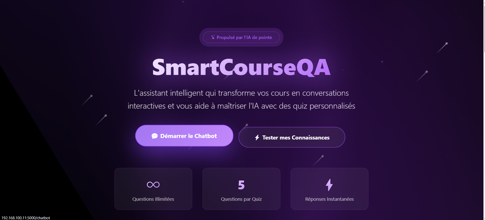
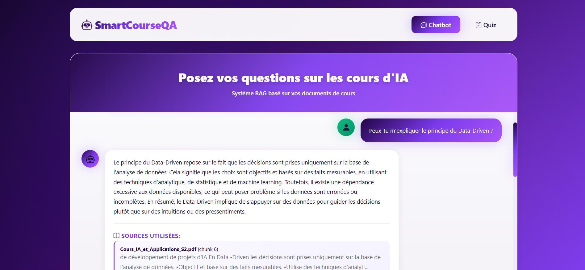
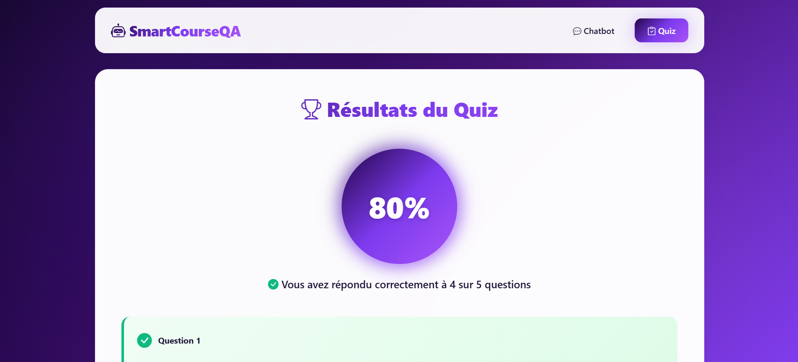

# SmartCourseQA - Application RAG Flask

Application web Flask avec système RAG (Retrieval-Augmented Generation) pour un chatbot intelligent et générateur de quiz basé sur vos cours d'intelligence artificielle.

## � Captures d'écran

### 🌌 Page d'Accueil

*Interface d'accueil avec effets galactiques et animations spatiales*

### 💬 Chatbot Intelligent

*Assistant conversationnel avec recherche RAG hybride*

### 📝 Générateur de Quiz

*Système de génération et d'évaluation de quiz IA*

## �🚀 Fonctionnalités

### 💬 Chatbot Intelligent
- Posez des questions sur vos cours d'IA
- Réponses basées sur le contenu de vos PDFs
- Affichage des sources utilisées pour chaque réponse
- Interface chat moderne et responsive

### 📝 Générateur de Quiz
- Génération automatique de 5 questions à choix multiples (QCM)
- Personnalisation du sujet selon vos besoins
- Questions basées sur le contenu réel de vos cours
- Format clair et structuré

### 🎯 Évaluation Automatique
- Correction automatique des réponses
- Affichage du score en pourcentage
- Explications détaillées pour chaque question
- Indication des réponses correctes/incorrectes

## 📦 Installation

### Prérequis
- Python 3.8 ou supérieur
- pip (gestionnaire de paquets Python)
- Clé API OpenRouter

### 1. Cloner le projet

```bash
git clone https://github.com/Jadir99/SmartCourseQA.git
cd SmartCourseQA
```

### 2. Créer un environnement virtuel

```powershell
# Windows PowerShell
python -m venv venv
.\venv\Scripts\Activate.ps1

# Linux/Mac
python3 -m venv venv
source venv/bin/activate
```

### 3. Installer les dépendances

```powershell
pip install -r requirements.txt
```

### 4. Configuration de l'API

Créez un fichier `.env` à la racine du projet :

```env
OPENROUTER_API_KEY=votre_clé_api_openrouter
```

**Obtenir une clé API :**
1. Créez un compte sur [OpenRouter](https://openrouter.ai/)
2. Allez dans les paramètres API
3. Générez une nouvelle clé
4. Copiez-la dans votre fichier `.env`

### 5. Ajouter vos documents

Placez vos fichiers PDF dans le dossier `data/` :

```
data/
├── cours_ia.pdf
├── machine_learning.pdf
└── deep_learning.pdf
```

## 🎮 Utilisation

### Démarrer l'application

```powershell
# Activer l'environnement virtuel
.\venv\Scripts\Activate.ps1

# Lancer l'application
python app.py
```

L'application sera accessible sur : **http://localhost:5000**

### Utiliser le Chatbot

1. Accédez à http://localhost:5000
2. Tapez votre question dans le champ de texte
3. Appuyez sur "Envoyer" ou la touche Entrée
4. Consultez la réponse et les sources utilisées

**Exemples de questions :**
- "Qu'est-ce que l'intelligence artificielle?"
- "Quels sont les principaux types de réseaux de neurones?"
- "Expliquez le fonctionnement du machine learning"
- "Quelles sont les applications du deep learning?"

### Générer un Quiz

1. Cliquez sur "Quiz" dans la navigation
2. Entrez le sujet désiré (ex: "réseaux de neurones")
3. Cliquez sur "Générer 5 Questions"
4. Répondez aux questions en sélectionnant les options
5. Cliquez sur "Soumettre mes réponses"
6. Consultez vos résultats avec explications détaillées

## 🛠️ Architecture Technique

### Stack Technologique

**Backend:**
- Flask 3.0.0 - Framework web Python
- LangChain - Orchestration du pipeline RAG
- FAISS - Base vectorielle pour recherche sémantique
- Sentence-Transformers - Modèle d'embeddings multilingue
- BM25 - Recherche lexicale (sparse retrieval)

**Frontend:**
- HTML5/CSS3 - Structure et style
- JavaScript ES6+ - Logique frontend
- Fetch API - Communication asynchrone

**LLM:**
- GPT-4o-mini via OpenRouter API

### Structure du Projet

```
SmartCourseQA/
├── app.py                     # Application Flask principale
├── requirements.txt           # Dépendances Python
├── .env                       # Configuration API (à créer)
├── README.md                  # Documentation
│
├── data/                      # Vos PDFs de cours
│   └── *.pdf
│
├── templates/                 # Templates HTML
│   ├── index.html            # Page chatbot
│   └── quiz.html             # Page quiz
│
├── static/                    # Fichiers statiques
│   └── style.css             # Styles CSS
│
├── venv/                      # Environnement virtuel
│
├── raw_documents.pkl          # Cache des documents
├── documents_chunks.pkl       # Cache des chunks
└── faiss_index/              # Index vectoriel FAISS
```

### Endpoints API

**`POST /api/chat`**
- Traite les questions du chatbot
- Entrée: `{ "question": "votre question" }`
- Sortie: `{ "answer": "réponse", "sources": [...] }`

**`POST /api/generate-quiz`**
- Génère un quiz personnalisé
- Entrée: `{ "topic": "sujet", "num_questions": 5 }`
- Sortie: `{ "questions": [...], "topic": "sujet" }`

**`POST /api/evaluate-quiz`**
- Évalue les réponses du quiz
- Entrée: `{ "answers": { "0": "A", "1": "B", ... } }`
- Sortie: `{ "score": 80, "correct_count": 4, "results": [...] }`

### Système RAG en Détail

1. **Chargement des documents** : Extraction du texte des PDFs
2. **Chunking** : Découpage en morceaux de 350 caractères avec overlap de 120
3. **Embeddings** : Vectorisation avec `multilingual-e5-large`
4. **Indexation** : Stockage dans FAISS pour recherche rapide
5. **Retrieval Hybride** : 
   - Dense (MMR) : 65% - recherche sémantique
   - Sparse (BM25) : 35% - recherche lexicale
6. **Génération** : GPT-4o-mini produit la réponse finale

## 🔧 Configuration Avancée

### Paramètres du RAG

Modifiez dans `app.py` :

```python
# Taille des chunks (ligne ~60)
text_splitter = RecursiveCharacterTextSplitter(
    chunk_size=350,      # Taille de chaque chunk
    chunk_overlap=120    # Overlap entre chunks
)

# Paramètres du retriever (ligne ~95)
dense_retriever = vectorstore.as_retriever(
    search_type="mmr",
    search_kwargs={
        "k": 3,          # Nombre de documents à récupérer
        "fetch_k": 4     # Documents candidats pour MMR
    }
)

# BM25 Retriever (ligne ~100)
sparse_retriever.k = 8   # Nombre de documents BM25

# Poids du retriever hybride (ligne ~105)
weights=[0.65, 0.35]     # [dense, sparse]
```

### Paramètres du LLM

```python
llm = ChatOpenAI(
    model_name="gpt-4o-mini",  # Modèle à utiliser
    temperature=0.4,            # Créativité (0-1)
    openai_api_key=OPENROUTER_API_KEY,
    openai_api_base="https://openrouter.ai/api/v1"
)
```

**Modèles disponibles via OpenRouter :**
- `gpt-4o-mini` - Rapide et économique (recommandé)
- `gpt-4o` - Plus puissant mais coûteux
- `claude-3-sonnet` - Alternative Anthropic
- `mistral-medium` - Open source performant

## 📊 Performance

**Initialisation :**
- Premier lancement : ~30-60 secondes (création des embeddings)
- Lancements suivants : ~5 secondes (chargement depuis cache)

**Utilisation :**
- Réponse chatbot : 2-5 secondes
- Génération quiz : 5-10 secondes (5 questions)
- Évaluation quiz : < 1 seconde

**Cache :**
- `raw_documents.pkl` : Documents extraits
- `documents_chunks.pkl` : Chunks de texte
- `faiss_index/` : Index vectoriel

Pour régénérer le cache (si vous modifiez les PDFs), supprimez ces fichiers.

## 🐛 Dépannage

### Erreur "ModuleNotFoundError"

```powershell
# Vérifier l'environnement virtuel
.\venv\Scripts\Activate.ps1

# Réinstaller les dépendances
pip install -r requirements.txt
```

### Erreur "No such file or directory: data/"

```powershell
# Créer le dossier data
mkdir data

# Ajouter vos PDFs
# Copier vos fichiers PDF dans ce dossier
```

### Clé API invalide

Vérifiez :
1. Le fichier `.env` existe à la racine
2. La clé est correctement formatée : `OPENROUTER_API_KEY=sk-or-...`
3. La clé est valide sur [OpenRouter](https://openrouter.ai/)

### Pas de réponses pertinentes

Solutions :
1. Vérifiez que vos PDFs contiennent du texte (pas seulement des images)
2. Supprimez les fichiers cache et relancez
3. Ajustez les paramètres du retriever (augmentez `k`)

### L'application est lente

Optimisations :
1. Réduisez `chunk_size` à 250
2. Diminuez `k` à 2 pour le retriever dense
3. Utilisez un modèle plus léger : `gpt-3.5-turbo`

## 🔒 Sécurité

**⚠️ Important :**
- Ne commitez **jamais** votre fichier `.env`
- Ajoutez `.env` au `.gitignore`
- Rotez régulièrement vos clés API
- Limitez les quotas sur OpenRouter

## 📝 Améliorations Futures

- [ ] Historique des conversations
- [ ] Export des quiz en PDF
- [ ] Support multi-utilisateurs avec authentification
- [ ] Base de données pour sauvegarder les scores
- [ ] Upload de PDFs via l'interface web
- [ ] Mode sombre
- [ ] Support de formats supplémentaires (DOCX, TXT, MD)
- [ ] Statistiques d'utilisation
- [ ] API REST publique

## 👨‍💻 Développement

### Contribuer

```bash
# Forker le repo sur GitHub
git clone https://github.com/votre-username/SmartCourseQA.git
cd SmartCourseQA

# Créer une branche
git checkout -b feature/ma-nouvelle-feature

# Faire vos modifications
# ...

# Commit et push
git add .
git commit -m "Ajout de ma feature"
git push origin feature/ma-nouvelle-feature

# Créer une Pull Request sur GitHub
```

### Tests

```powershell
# Tester le chargement des documents
python -c "from app import initialize_rag_system; initialize_rag_system()"

# Tester le chatbot
python app.py
# Accéder à http://localhost:5000 et tester
```

## 📄 Licence

Ce projet est sous licence MIT - voir le fichier [LICENSE](LICENSE) pour plus de détails.

## 🤝 Support

**Questions ou bugs ?**
- Créez une [issue sur GitHub](https://github.com/Jadir99/SmartCourseQA/issues)
- Contactez-moi : [votre email]

## 🙏 Remerciements

- [LangChain](https://www.langchain.com/) - Framework RAG
- [OpenRouter](https://openrouter.ai/) - API LLM
- [HuggingFace](https://huggingface.co/) - Modèles d'embeddings
- [FAISS](https://github.com/facebookresearch/faiss) - Recherche vectorielle

---

**Bon apprentissage avec SmartCourseQA ! 🎓✨**
